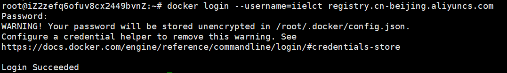
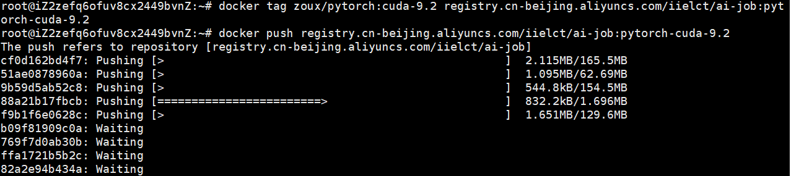
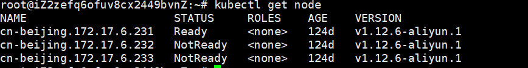

[toc]

# 如何通过GPU管理器提交训练

​		GPU管理器的目的是为了对阿里云GPU资源进行统一管理，提高资金和资源利用效率，避免浪费。用户无需自己创建ECS节点并配置环境，只需通过命令行接口提交训练作业，待作业完成后，从存储中下载日志和训练完的模型。GPU管理器还提供了作业状态监控接口，可随时查看作业状态。

​       本文档以mnist为例，说明了如何使用GPU管理器。

## 0. 创建Docker镜像

**我们已经为知识组的同学建立好了镜像，具体请看附录B**

​         不同的用户有自己的训练环境。用户可以定制自己的Docker镜像，这样可以解决环境搭建问题。创建具体镜像的步骤省略，可参考网上教程。接下来详细介绍如何将自己的镜像上传到阿里云镜像仓库中。

（1）登录阿里云Docker Registry

```rust
sudo docker login --username=iielct registry.cn-beijing.aliyuncs.com
```

密码：iielct123



(2)  上传自己的镜像到阿里云镜像仓库

```rust
// 将镜像tag成阿里云镜像的格式
docker tag [ImageId] registry.cn-beijing.aliyuncs.com/iielct/ai-job:[镜像版本号]   
// 上传镜像
docker push registry.cn-beijing.aliyuncs.com/iielct/ai-job:[镜像版本号]
```

***请根据实际镜像信息替换示例中的[ImageId]和[镜像版本号]参数***。

举例说明：我生成了一个自己的镜像zoux/pytorch:cuda-9.2，我将它上传到阿里云镜像仓库步骤如下：

```
docker tag zoux/pytorch:cuda-9.2 registry.cn-beijing.aliyuncs.com/iielct/ai-job:pytorch-cuda-9.2     
docker push registry.cn-beijing.aliyuncs.com/iielct/ai-job:pytorch-cuda-9.2
```



等到镜像上传完即可。


## 1. 安装kubectl客户端

（1）下载kubectl 安装包

```rust
curl -LO https://storage.googleapis.com/kubernetes-release/release/v1.17.0/bin/linux/amd64/kubectl
```

(2)  添加可执行权限，复制到/usr/local/bin/ 目录

```rust
chmod +x ./kubectl
sudo mv ./kubectl /usr/local/bin/kubectl
```

（3）验证是否安装成功

```rust
kubectl version
```

（4）连接到k8s集群

在 $HOME/.kube/ 目录下创建config文件，将下面内容复制到config文件中。

```rust
apiVersion: v1
clusters:
- cluster:
    server: https://39.105.83.133:6443
    certificate-authority-data: LS0tLS1CRUdJTiBDRVJUSUZJQ0FURS0tLS0tCk1JSURHakNDQWdLZ0F3SUJBZ0lCQURBTkJna3Foa2lHOXcwQkFRc0ZBREErTVNjd0ZBWURWUVFLRXcxaGJHbGkKWVdKaElHTnNiM1ZrTUE4R0ExVUVDaE1JYUdGdVozcG9iM1V4RXpBUkJnTlZCQU1UQ210MVltVnlibVYwWlhNdwpIaGNOTVRrd09ESXpNREkwTmpRMVdoY05Namt3T0RJd01ESTBOalExV2pBK01TY3dGQVlEVlFRS0V3MWhiR2xpCllXSmhJR05zYjNWa01BOEdBMVVFQ2hNSWFHRnVaM3BvYjNVeEV6QVJCZ05WQkFNVENtdDFZbVZ5Ym1WMFpYTXcKZ2dFaU1BMEdDU3FHU0liM0RRRUJBUVVBQTRJQkR3QXdnZ0VLQW9JQkFRQzlQd1FBd0o0MzZEQjkwQXVyOEFMbQpIQVdRTnIzMnJ2SmhWdHBpa0FEVUN1ZlMwZ3Y2UktLSy9qOHNGK0NvQ0pWVTF1VFJJQU5KOVBBVlpiTEFSVUJhCk5aa1hBVUVuaWZSSjZxZVBoR3E5cks5a2ZONUUvOE1MNGx3R1FaZGZ1SzJobXlnUytnNzg5ZVpvZmFyVno0b3AKN3RjRnZuTnlhMGUxZzM4V0xzN05Bbk13UldnN09jTDM2V0Z3WHVaNmJnNjlFVUNWTzB0cE1zTTdYTE1BOUF4awp6b2NEVXhzeWQ0anM0V2tvamc1WWNDQ2s4STdpdURPOXVtV1JQc3c4RTIyMlp5MlZPTlo2cmp3TURGeFZuVEZ0Ci9FaW1Vd3dybXc5SEQwTFQ3NGFUV1NBb0dmUElRVlBKNUppZ0I2cTZ0WW04bFdKU0xsdGMrV2RSbXRST0dPUjUKQWdNQkFBR2pJekFoTUE0R0ExVWREd0VCL3dRRUF3SUNwREFQQmdOVkhSTUJBZjhFQlRBREFRSC9NQTBHQ1NxRwpTSWIzRFFFQkN3VUFBNElCQVFCSHdoNkhmU2wyNzV5TU5jdlgvMzlzMjN6dTRERkt5VGphbEdaWnRqWUcxQ2VhCkhvMkdKN0tIMmdaU3pHOVRZcTc1MEpVUkJ0TUEzZ2hyemJWbVFlL1ZqOWxhU0hrWTRYUU9aREdnUGNzbVpRRUYKd3MraHBjVDFYWDFEK1pFaG5GVlBmZ3RaZUFqaktmQnpybGxFcGc3T3ZEeVdMNm1VRUg1NWZrcnJwc3pqQW5ueQoxSXlZTE5SS3J2UFRtaUZjSWd1UkMxSlBCUFlyTkwvYmRvUjhIQ1N2R3YrWHJOcys3RUZpSFZTY2w0d2ZFSzR4ClFXTGRrWkU1VDRkZXp2Njhod1ZtaE5kYXpvOFY0TkdKVCt1dVFFeUFzeE5WTkNUdC9xUXJlSXVhSFBld0tMWWsKRU1qeGU3ekhQS2NMUjVBN29mcmVOUVhleGpYNVVuazFZWmlVU3JOSQotLS0tLUVORCBDRVJUSUZJQ0FURS0tLS0tCg==
  name: kubernetes
contexts:
- context:
    cluster: kubernetes
    user: "kubernetes-admin"
  name: kubernetes-admin-cb76676aa34fd492fbdb79014a4c59d53
current-context: kubernetes-admin-cb76676aa34fd492fbdb79014a4c59d53
kind: Config
preferences: {}
users:
- name: "kubernetes-admin"
  user:
    client-certificate-data: LS0tLS1CRUdJTiBDRVJUSUZJQ0FURS0tLS0tCk1JSUN6VENDQWphZ0F3SUJBZ0lERVNRME1BMEdDU3FHU0liM0RRRUJDd1VBTUdveEtqQW9CZ05WQkFvVElXTmkKTnpZMk56WmhZVE0wWm1RME9USm1ZbVJpTnprd01UUmhOR00xT1dRMU16RVFNQTRHQTFVRUN4TUhaR1ZtWVhWcwpkREVxTUNnR0ExVUVBeE1oWTJJM05qWTNObUZoTXpSbVpEUTVNbVppWkdJM09UQXhOR0UwWXpVNVpEVXpNQjRYCkRURTVNRGd5TkRFek16SXdNRm9YRFRJeU1EZ3lNekV6TXpjd01Gb3dQekVYTUJVR0ExVUVDaE1PYzNsemRHVnQKT20xaGMzUmxjbk14Q1RBSEJnTlZCQXNUQURFWk1CY0dBMVVFQXhNUWEzVmlaWEp1WlhSbGN5MWhaRzFwYmpDQgpuekFOQmdrcWhraUc5dzBCQVFFRkFBT0JqUUF3Z1lrQ2dZRUF0SXFxZDRyZW9XSkVkMG1OK0l4RllUYVhCcHZRCjZia0tzczk4Q1E3U0ZPTGcvUmdNS1VmSkREMWF5amdsN3I3dlJQQXhBVllZT3pmSmJUckhId1llQ3I4SmEwS28KVndxR21CQVB4Y1NsZFk2Sm85cWRnaVdHbWtwUVpRc1NPWDJmODNWZ2JyaVZySjZ6VlMrS0o3U0s1UlFrZmVWWgpkcGZEUkpBMXgyMlc1ZU1DQXdFQUFhT0JxekNCcURBT0JnTlZIUThCQWY4RUJBTUNCNEF3RXdZRFZSMGxCQXd3CkNnWUlLd1lCQlFVSEF3SXdEQVlEVlIwVEFRSC9CQUl3QURBOEJnZ3JCZ0VGQlFjQkFRUXdNQzR3TEFZSUt3WUIKQlFVSE1BR0dJR2gwZEhBNkx5OWpaWEowY3k1aFkzTXVZV3hwZVhWdUxtTnZiUzl2WTNOd01EVUdBMVVkSHdRdQpNQ3d3S3FBb29DYUdKR2gwZEhBNkx5OWpaWEowY3k1aFkzTXVZV3hwZVhWdUxtTnZiUzl5YjI5MExtTnliREFOCkJna3Foa2lHOXcwQkFRc0ZBQU9CZ1FCUFlxbjVZM3BGcW1POGhWVmllR1NrNzRReEZLd0ZhV2dEZWd6VW9EMloKWWZ4c0FhMFVkRlZnQXdhaGorSUxUU3dNVTAyR0RLK1R3dDdIQ2kvbFlCLzhUVjI1eVlMOFVQQ1NWa01PRlBMVAp5VHJVbisrS1VhWk1hcmV1bU9lOEM1VkdPcjVYSFRhTXkvbjRldjlPUFNnN0tTNnNVVWZwNnlTY2ZRSFZicTRtCkRnPT0KLS0tLS1FTkQgQ0VSVElGSUNBVEUtLS0tLQotLS0tLUJFR0lOIENFUlRJRklDQVRFLS0tLS0KTUlJQy96Q0NBbWlnQXdJQkFnSURFUjgwTUEwR0NTcUdTSWIzRFFFQkN3VUFNR0l4Q3pBSkJnTlZCQVlUQWtOTwpNUkV3RHdZRFZRUUlEQWhhYUdWS2FXRnVaekVSTUE4R0ExVUVCd3dJU0dGdVoxcG9iM1V4RURBT0JnTlZCQW9NCkIwRnNhV0poWW1FeEREQUtCZ05WQkFzTUEwRkRVekVOTUFzR0ExVUVBd3dFY205dmREQWVGdzB4T1RBNE1qTXcKTWpReE1EQmFGdzB6T1RBNE1UZ3dNalEyTWpOYU1Hb3hLakFvQmdOVkJBb1RJV05pTnpZMk56WmhZVE0wWm1RMApPVEptWW1SaU56a3dNVFJoTkdNMU9XUTFNekVRTUE0R0ExVUVDeE1IWkdWbVlYVnNkREVxTUNnR0ExVUVBeE1oClkySTNOalkzTm1GaE16Um1aRFE1TW1aaVpHSTNPVEF4TkdFMFl6VTVaRFV6TUlHZk1BMEdDU3FHU0liM0RRRUIKQVFVQUE0R05BRENCaVFLQmdRRGVhU21iK2ZJVEdCbm1QOUZRTk9WU3RpOWh6bk1XODBaYjNQL2dvbW11RGtadgpQMDRrellTRVczdHA0dWlTbnJmWDlTSGlDMi9QZGM3QlI3RFdjV1R2TGNwZjVpZzZtbitnemtvUkc0STdRZndyCjRXMnJBL2VMS0tDK3dHMXJEaHQ5TWJSN2VvMk5ONmtwdlYxWlZoelBXSFR3M05Kam5Kd3NMZDZvMmN5NWt3SUQKQVFBQm80RzZNSUczTUE0R0ExVWREd0VCL3dRRUF3SUNyREFQQmdOVkhSTUJBZjhFQlRBREFRSC9NQjhHQTFVZApJd1FZTUJhQUZJVmEvOTBqelNWdldFRnZubTFGT1p0WWZYWC9NRHdHQ0NzR0FRVUZCd0VCQkRBd0xqQXNCZ2dyCkJnRUZCUWN3QVlZZ2FIUjBjRG92TDJObGNuUnpMbUZqY3k1aGJHbDVkVzR1WTI5dEwyOWpjM0F3TlFZRFZSMGYKQkM0d0xEQXFvQ2lnSm9Za2FIUjBjRG92TDJObGNuUnpMbUZqY3k1aGJHbDVkVzR1WTI5dEwzSnZiM1F1WTNKcwpNQTBHQ1NxR1NJYjNEUUVCQ3dVQUE0R0JBR1lDMUtJbGNNVjM5TUM2YldRbXpUd1laa1JuRkMrMHJkTmFKRkg3CmR5SEdabzA2VVNuSEh4a0FYNmxSVFFTczVEVElnbldYVEdTc2V3OFBDSTlPbzhNS1V3WWVGelJHeTQ3NjFtdHEKWXpzQ3k5VHlaY081cTdoVUcvMGEvL3piYTBWbXhCSWVOM0lkeVllUE5oWGJuNEVWWmZUSkZPUzgrRTZJdlF1UgpybGgwCi0tLS0tRU5EIENFUlRJRklDQVRFLS0tLS0K
    client-key-data: LS0tLS1CRUdJTiBSU0EgUFJJVkFURSBLRVktLS0tLQpNSUlDV3dJQkFBS0JnUUMwaXFwM2l0NmhZa1IzU1kzNGpFVmhOcGNHbTlEcHVRcXl6M3dKRHRJVTR1RDlHQXdwClI4a01QVnJLT0NYdXZ1OUU4REVCVmhnN044bHRPc2NmQmg0S3Z3bHJRcWhYQ29hWUVBL0Z4S1Yxam9tajJwMkMKSllhYVNsQmxDeEk1ZlovemRXQnV1SldzbnJOVkw0b250SXJsRkNSOTVWbDJsOE5Fa0RYSGJaYmw0d0lEQVFBQgpBb0dBT09NQWQ0NVFPL1drc1JtQ0hIREdZNjA1eFNGUG9IVm53NVBROTJHdUhGcW9uZGIzN2dIcWZXclBzcXdpCmQ2bTk1ckR3SUFXcXVPNEpEOXZYWmhVZFhhbmZMQms3S2lNODMyK1kyMGlsZXRPMzVFaHBiOGkzOXcrWUFxNUEKenBJdDd0TGMvam1CZ3RjRjNXZ0dYdzIwcU1YSzl3R2R2NU9TYk9TdEsxbi9YeEVDUVFET1FhZmJUZ2pZYVJneAp1NHkxeUo4cCtCRGdYMzdlbjVmSnhzR1JUY2phczI5cUhLUVBWcmVMazQreThKcURtK204WHorQmtkakF3UmlQCk1VdDMyRjR0QWtFQTRCVmVsZWFNbVFYOGVtMzVIcml4cnI1em0rMjZEc3ZXakNjZ3U0MThZR3Rzd0p5ZG9QRnkKUjF0U1htRGlLTzIySEtPOG9uTTZKcDlpMWNhU29kVHVUd0pBSS9UY0wyWW1NcHYzcE12ZVZ0NTNxTmhmRU01MQpEcGhoM01JeWdvTTk3YXAwVk5wVFczMHhtRHFNUlpTZVN5MUdEUm5KdDJ2V2pwdmJEVE41eFpYSnJRSkFZbzBqCmJ6dlpSQWVjOWQ5ZC9BUHdxVkM3bWExZzhkYjJRZWVIZnRVSUNZUFZiWlN6d3EvTnVkSlJGSTc1aUZTYmpsYjQKeEYxM0NydDRoVnB5N05ld0F3SkFOS1B6SWUyc0I0bVNpWWVacFFYaFBoNDF0TDIwb0tFMjZBOXpKQkI3Ykc0WQpTU0RlWlFqTFljV1pneWlzaFZuS1ZaOElIR0F6Sy9LTlJpYXJTZkRWQWc9PQotLS0tLUVORCBSU0EgUFJJVkFURSBLRVktLS0tLQo=
```

(5)查看是否连接成功

kubectl get node




## 2. 挂载共享存储NAS目录

​        把共享存储NAS挂载到一个本地目录上，以便上传数据和代码、保存日志和模型（这些内容最终都保存在NAS中，而不是容器里）。
（1）安装NFS客户端

```rust
apt-get update && apt-get install -y nfs-common
```
 centos执行命令
```rust
yum install -y nfs-utils
```


（2）  挂载本地目录到NAS文件系统（/code是一个远程的目录，请不要改动。/nfs/testdata 是本地目录，需要事先创建好）

```rust
mount -t nfs -o vers=4.0 111df49a6b-qxt10.cn-beijing.nas.aliyuncs.com:/code /nfs/testdata
```

***重要：*** 所有训练中使用到的数据（训练程序和训练数据等）和要保存的文件（日志和模型等）一定要放在挂载卷的目录下面 。 为避免数据覆盖，需为每次训练创建一个子目录（后续版本会将这一过程自动化）。

​       以本教程为例，第一次提交作业前都要在/nfs/testdata下创建一个子目录，如/nfs/testdata/zoux/job1，第二次提交作业前创建/nfs/testdata/zoux/job2，。。。（实际数据保存在NAS的/code/zoux/job1目录下。)。创建目录后，设置目录的权限：

 ```rust
chmod +777 /nfs/testdata/zoux/job1
 ```

​         在本教程的yaml例子中 (见第5步)，容器中的挂载地址是/code（挂载目录名可以改变。这里的code是为作业创建的容器中的一个目录，实际是映射到了NAS文件系统中的/code。NAS中的/code不可改名。NAS中的code同样映射到了客户端的/nfs/testdata目录中。容器的/code、NAS的/code和客户端的/nfs/testdata实际是同一个目录），就需要在代码中把所有要保存的文件写入/code/zoux/job1目录，才能持久保存。

```rust
 volumeMounts:
          - name: pvc-sleep
            mountPath: "/code"      //容器中的的挂载地址，放在这里才能保存到NAS中。
```
​       

## 3. 编写模型代码

​	训练日志、模型的保存以及其它需要持久化存储的内容，都需要自己在代码中实现，可以参考pytorch.py。务必要修改代码中读取和保存数据的语句所使用的路径。

​    代码编写完成后，先自行测试通过，再进行后续步骤。

​      

## 4. 上传代码与训练集

​	将代码和数据拷贝到/nfs/testdata/zoux/job1目录下。由于数据实际存储在远程的NAS中（实际保存在NAS的/code目录下），上传过程需要等待一定时间才能完成。

<br>

PS：挂载错误排查

 https://help.aliyun.com/document_detail/129698.html?spm=a2c4g.11186623.2.23.62ebaa3d5K90K2#concept-1614284 


## 5. 编写作业描述文件(.yaml)

​	提交作业使用下面的yaml模板，模板中（1)(2)(3)(4) 需根据自己的作业情况进行修改。

```rust
apiVersion: batch.volcano.sh/v1alpha1
kind: Job
metadata:
  name: nas-pytorch-job                 //（1）修改成自己job的名字，作业名不能重复
spec:
  minAvailable: 1
  schedulerName: volcano
  policies:
    - event: PodEvicted
      action: RestartJob
  plugins:
    ssh: []
    env: []
    svc: []
  maxRetry: 5
  queue: default
  tasks:
    - replicas: 1
      name: "task-1"            //（2）任务名称
      template:
        metadata:
          name: pytorch-gpu-job
        spec:
          containers:
            - name: pytorch-gpu-job
              image: registry.cn-beijing.aliyuncs.com/iielct/ai-job:pytorch-cuda-9.2 //使用自己上传的阿里云镜像
              command: ["python","/code/pytorch.py"]    //(3)将pytorch.py替换成自己的文件
              resources:
                limits:
                  nvidia.com/gpu: "1"        //(4) 使用的GPU数量，requests和limits保持一致，目前只支持1个GPU
                requests:
                  nvidia.com/gpu: "1"
              volumeMounts:
              - name: pvc-sleep
                mountPath: "/code"           
          volumes:
            - name: pvc-sleep
              persistentVolumeClaim:
                claimName: pvc-sleep
          restartPolicy: OnFailure
```

command是容器内执行的命令，有两种方式：

- 直接写运行命令，如果带着命令行参数，那参考下面的例子

    ```rust
    command: ["python", "pytorch.py"]
    args: ["-train", "-batch_size", "8"]
    ```

    这种方式有个问题，就是一次只能执行一个命令，不够灵活，如果依赖项在conda之类的虚拟环境中需要激活自己的conda环境，可以采用下面这种方式。

- 编写shell，例如(这里conda 虚拟环境的名字为work)：

    ```shell
    #!/usr/bin/env bash
    # >>> conda initialize >>>
    # !! Contents within this block are managed by 'conda init' !!
    __conda_setup="$('/home/user/miniconda/envs/py36/bin/conda' 'shell.bash' 'hook' 2> /dev/null)"
    if [ $? -eq 0 ]; then
        eval "$__conda_setup"
    else
        if [ -f "/home/user/miniconda/envs/work/etc/profile.d/conda.sh" ]; then
            . "/home/user/miniconda/envs/work/etc/profile.d/conda.sh"
        else
            export PATH="/home/user/miniconda/envs/work/bin:$PATH"
        fi
    fi
    unset __conda_setup
    # <<< conda initialize <<<
    conda activate work
    
    # run command here
    python pytorch.py -train -batch_size 8
    ```

    在1-13行初始化conda环境，在16行激活自己的conda环境，19行开始可以连续写很多命令，会依次执行。


## 6. 提交、删除作业

（1）进入 作业的 yaml文件的同级目录，假设job的Yaml文件命名为： job.yaml

（2）使用下面的命令进行创建

```rust
kubectl create -f job.yaml
```

出现下面的显示则创建成功

job.batch.volcano.sh/nas-pytorch-job  created

（3）使用下面的命令删除作业，在作业出错，或者大改的情况下删除作业再重新提交。

```
kubectl delete -f job.yaml
```

PS：如果创建失败，也会出现显示具体错误原因。一般原因是job命名冲突，或者yaml格式错误（有严格的缩进）


## 7. 查看作业执行状态

使用 " kubectl get pod" 查看job的情况


pod 目前有三个正常的状态：**Pending（等待调度）, Running(作业运行中)，Completed（已完成）**。


## 8. 下载日志及模型

进入/nfs/testdata/zoux/job1 (自己本机的挂载地址) 即可查看日志文件和模型。


## Appendix A. 错误排查

如果出现pod的状态是 Error或者是CrashLoopBackOff 。使用下面的命令查看具体原因：

```rust
kubectl describe pod podName   //这里的podName是一个变量，要替换正在的pod的名称（上图中最左边一列）
```

 如果程序出错，执行  kubectl logs podname 命令查看错误输出。 

 执行 Kubectl delete -f job.yaml命令（job.yaml为提交作业时使用的yaml文件名）可删除错误作业，或执行kubectl delete   jobs.batch.volcano.sh  jobName。


### 任务运行失败常见的原因

（1) 文件或者数据找不到

这是由于NAS文件还在上传，等待一段时间即可

（2）文件权限错误

修改本地目录（本来例子中是/nfs/testdata）的权限

例如： chmod 777 /nfs/testdata -r 


### 挂载错误排查

 https://help.aliyun.com/document_detail/129698.html?spm=a2c4g.11186623.2.23.62ebaa3d5K90K2#concept-1614284 


## Appendix B. docker镜像相关

目前为大家建立了docker镜像，按照收集到的requirement文件，不过在建立的过程中由于阿里云的pip源不全，以及部分库可能包含其他依赖（C库）导致安装失败，所以大家还是需要拉取自己的镜像做微调，同时也方便在本地验证代码的正确性，实验室在阿里云上建立了镜像仓库，仓库地址

```
registry.cn-beijing.aliyuncs.com/iielct/
username: iielct
password: iielct123
```
为大家建立的docker镜像列表（发送requirements的同学），名称为名字首字母小写-dev:版本号

```shell
registry.cn-beijing.aliyuncs.com/iielct/zy-dev     1.0                 9b361a82db03
registry.cn-beijing.aliyuncs.com/iielct/sp-dev     1.0                 b0c9611c3b63
registry.cn-beijing.aliyuncs.com/iielct/qwh-dev    1.0                 e50e80d383b3
registry.cn-beijing.aliyuncs.com/iielct/wlw-dev    1.0                 737a62dfa3b3
registry.cn-beijing.aliyuncs.com/iielct/sxh-dev    1.0                 a1c9f304359f
registry.cn-beijing.aliyuncs.com/iielct/wdj-dev    1.0                 3004884c6286
registry.cn-beijing.aliyuncs.com/iielct/ycy-dev    1.0                 f98022bd2f07
registry.cn-beijing.aliyuncs.com/iielct/zwb-dev    1.0                 8d2527648642
registry.cn-beijing.aliyuncs.com/iielct/zl-dev     1.0                 d53a58641632
registry.cn-beijing.aliyuncs.com/iielct/lyx-dev    1.0                 9479281f9b62
registry.cn-beijing.aliyuncs.com/iielct/mqw-dev    1.0                 d37f5a74d882
registry.cn-beijing.aliyuncs.com/iielct/lsw-dev    1.0.1               531ac9403099
registry.cn-beijing.aliyuncs.com/iielct/lmm-dev    1.0.1               3cad087707ee
registry.cn-beijing.aliyuncs.com/iielct/nlp-base   cuda-10.0           4d578c17a968
```

所有镜像都是基于ubuntu 16.06 64位系统，conda里面有两个虚拟环境，一个是$work$ ，一个是$env$，work是之前测试过程中建立的，基本包含了自然语言处理常用的类库，env是根据大家的requirements建立的，不过一部分包安装失败了。不想折腾的同学可以直接激活work环境试试是否可以满足要求。

##### 安装docker

略

##### 拉取并运行镜像

```shell
docker run -it [自己的镜像完整路径]:[版本号] /bin/bash
```

比如

```
docker run -it registry.cn-beijing.aliyuncs.com/iielct/sxh-dev:1.0 /bin/bash
```

命令会拉取镜像并运行，直接进入终端，默认激活了env环境。

##### 测试环境

可以通过挂载目录的方式让docker共享本地代码文件夹，本地文件夹需要指定绝对路径，例如我希望本地的/home/user/code/test/指定到docker的/app目录下，可以执行

```
docker run -it -v /home/user/code/test:/app registry.cn-beijing.aliyuncs.com/iielct/sxh-dev:1.0 /bin/bash
```

之后就可以在docker里测试代码和补全开发环境了，修改完成记得保存（见下一节）。

##### 保存环境

使用docker的commit命令保存容器为新的镜像，docker run的时候终端会有个容器的id，在终端可以看到，例如运行docker的终端名字

```shell
(env) user@ad4bce6db5fd:/app$ 
```

其中ad4bce6db5fd就是容器id，假设此时已经完成了对容器的修改，exit命令退出回到本地终端，运行

```shell
docker commit ad4bce6db5fd [新镜像名称]
```

我们为大家的镜像做了版本号，为了区分方便，每次修改建议给不同的版本号，初始默认是1.0，修改之后可以分配为1.0.1，例如

```shell
docker commit ad4bce6db5fd registry.cn-beijing.aliyuncs.com/iielct/sxh-dev:1.0.1
```

##### 推送镜像到仓库

```shell
docker push [镜像名]
```

例如

```shell
docker push registry.cn-beijing.aliyuncs.com/iielct/sxh-dev:1.0.1
```

这样就完成了自己的镜像的更新。后续任务可以指定更新后的镜像了。

##### 其他

未发送依赖库的同学可以以仓库任意镜像为基类（建议用nlp-base）安装前述步骤创建自己的镜像并推送。有问题可以群里问。